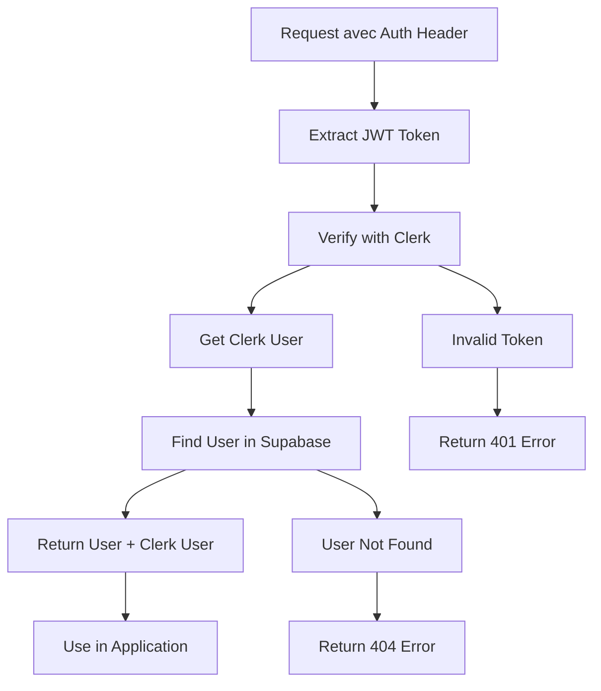
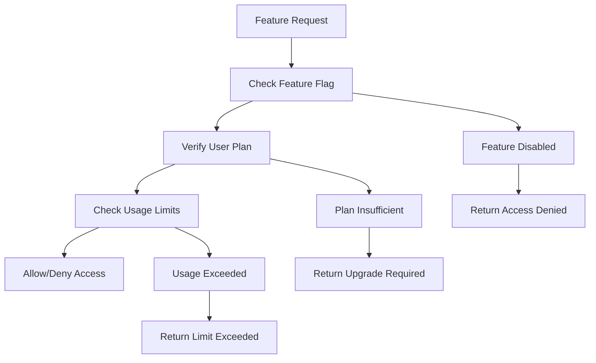

# Architecture Editia Core

## Vue d'Ensemble

Ce document décrit l'architecture du package `@editia/core` qui centralise toute la logique partagée entre les différents projets Editia.

## 🏗️ Structure du Package

```
@editia/core/
├── src/
│   ├── types/
│   │   ├── database.ts          # Types Supabase générés
│   │   ├── auth.ts              # Types d'authentification
│   │   ├── feature-flags.ts     # Types des feature flags
│   │   ├── usage-tracking.ts    # Types de suivi d'usage
│   │   ├── subscriptions.ts     # Types d'abonnements
│   │   └── index.ts             # Export centralisé
│   ├── services/
│   │   ├── auth/
│   │   │   ├── clerk-auth.ts    # Service d'authentification Clerk
│   │   │   ├── user-management.ts # Gestion des utilisateurs
│   │   │   └── index.ts
│   │   ├── monetization/
│   │   │   ├── feature-access.ts # Service de vérification d'accès
│   │   │   ├── usage-tracking.ts # Service de suivi d'usage
│   │   │   ├── subscription-sync.ts # Synchronisation des abonnements
│   │   │   └── index.ts
│   │   └── index.ts
│   ├── middleware/
│   │   ├── auth/
│   │   │   ├── authenticate.ts   # Middleware d'authentification
│   │   │   ├── require-auth.ts   # Middleware d'authentification requise
│   │   │   ├── optional-auth.ts  # Middleware d'authentification optionnelle
│   │   │   └── index.ts
│   │   ├── monetization/
│   │   │   ├── usage-limit.ts    # Middleware de limitation d'usage
│   │   │   ├── feature-gate.ts   # Middleware de gating
│   │   │   └── index.ts
│   │   └── index.ts
│   ├── utils/
│   │   ├── api-headers.ts        # Gestion des headers API
│   │   ├── error-handling.ts     # Gestion d'erreurs
│   │   ├── logging.ts            # Système de logging
│   │   ├── database-sync.ts      # Synchronisation des types DB
│   │   ├── plan-validation.ts    # Validation des plans
│   │   ├── usage-calculations.ts # Calculs d'usage
│   │   └── index.ts
│   └── index.ts                  # Point d'entrée principal
├── scripts/
│   ├── generate-types.ts         # Génération des types Supabase
│   ├── sync-types.ts             # Synchronisation des types
│   └── build.ts                  # Script de build
├── package.json
├── tsconfig.json
├── README.md
└── CHANGELOG.md
```

## 🔄 Flux d'Authentification



## 💰 Flux de Monétisation



## 🔐 Sécurité

### Row Level Security (RLS)

Le package utilise la clé de service role (`SUPABASE_SERVICE_ROLE_KEY`) pour contourner les politiques RLS lors des opérations serveur. Cela permet :

- **Lecture des utilisateurs** : Accès aux données utilisateur sans restrictions RLS
- **Opérations d'administration** : Gestion des utilisateurs et des abonnements
- **Synchronisation** : Mise à jour des données utilisateur depuis les services

### Authentification

- **Clerk JWT** : Vérification des tokens JWT avec Clerk
- **Supabase User** : Récupération des données utilisateur depuis Supabase
- **Service Role** : Utilisation de la clé de service pour les opérations serveur

## 📊 Types de Données

### Authentification

```typescript
interface AuthConfig {
  clerkSecretKey: string;
  supabaseUrl: string;
  supabaseServiceRoleKey: string;
  environment?: 'development' | 'production' | 'test';
}

interface DatabaseUser {
  id: string;
  clerk_user_id: string;
  email: string;
  created_at: string;
  updated_at: string;
}

interface AuthResult {
  user: DatabaseUser | null;
  clerkUser: any | null;
  errorResponse?: AuthErrorResponse;
}
```

### Monétisation

```typescript
interface FeatureFlag {
  id: string;
  name: string;
  description: string;
  required_plan: string | null;
  is_active: boolean;
}

interface UserUsage {
  user_id: string;
  current_plan_id: string;
  videos_generated_count: number;
  videos_generated_limit: number;
  source_videos_uploaded_count: number;
  source_videos_limit: number;
  account_analysis_count: number;
  account_analysis_limit: number;
  voice_clones_limit: number;
  next_reset_date: string;
}
```

## 🚀 Déploiement

### Build Process

1. **TypeScript Compilation** : `npm run build`
2. **Tests** : `npm test`
3. **Publish** : `npm publish`

### Versioning

Le package suit le [Semantic Versioning](https://semver.org/) :

- **MAJOR** : Changements incompatibles
- **MINOR** : Nouvelles fonctionnalités compatibles
- **PATCH** : Corrections de bugs compatibles

## 📈 Évolution

### Phase 1 : Authentification ✅

- [x] Service Clerk Auth
- [x] Middleware d'authentification
- [x] Types de base de données

### Phase 2 : Monétisation 🚧

- [ ] Feature flags
- [ ] Usage tracking
- [ ] Subscription sync

### Phase 3 : Avancé 📋

- [ ] Analytics
- [ ] Notifications
- [ ] Multi-tenant support

## 🔗 Liens Utiles

- **[Installation & Configuration](../setup/README.md)**
- **[API Reference](../api/README.md)**
- **[Migration Guide](../migration/README.md)**
- **[Stratégie Commerciale](../business/strategy.md)**
