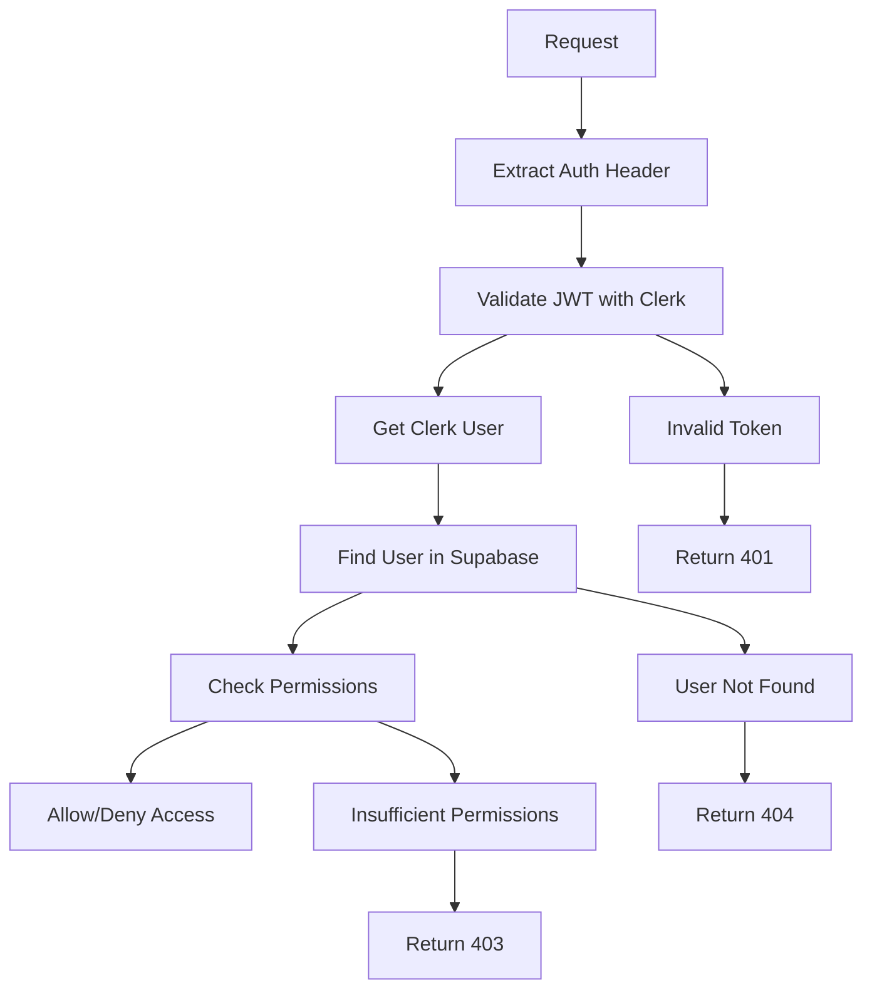

# Sécurité & Row Level Security (RLS)

## Vue d'Ensemble

Ce document détaille les mesures de sécurité mises en place dans le package `@editia/core`, notamment la gestion des politiques Row Level Security (RLS) de Supabase.

## 🔐 Authentification

### Clerk JWT Tokens

Le package utilise Clerk pour l'authentification avec des tokens JWT sécurisés :

```typescript
// Vérification du token JWT
const { user, errorResponse } = await ClerkAuthService.verifyUser(authHeader);
```

**Sécurité :**

- **Signature numérique** : Les tokens sont signés par Clerk
- **Expiration automatique** : Les tokens expirent après un délai défini
- **Vérification côté serveur** : Validation avec la clé secrète Clerk

### Variables d'Environnement

**Variables requises :**

```bash
# Clerk (obligatoire)
CLERK_SECRET_KEY=sk_test_...

# Supabase (obligatoire)
SUPABASE_URL=https://your-project.supabase.co
SUPABASE_SERVICE_ROLE_KEY=eyJ...

# Environment (optionnel)
NODE_ENV=development
```

**Sécurité :**

- **Ne jamais commiter** les clés secrètes
- **Utiliser des variables d'environnement** pour toutes les clés
- **Valider les variables** au démarrage

## 🛡️ Row Level Security (RLS)

### Principe

Row Level Security est une fonctionnalité de PostgreSQL qui permet de contrôler l'accès aux lignes d'une table en fonction de l'utilisateur qui effectue la requête.

### Politiques RLS sur la Table `users`

```sql
-- Politique d'insertion
CREATE POLICY "Users can insert their own data" ON users
FOR INSERT WITH CHECK (auth.uid() = clerk_user_id);

-- Politique de lecture
CREATE POLICY "Users can read their own data" ON users
FOR SELECT USING (auth.uid() = clerk_user_id);

-- Politique de mise à jour
CREATE POLICY "Users can update their own data" ON users
FOR UPDATE USING (auth.uid() = clerk_user_id);
```

### Contournement RLS avec Service Role

Le package utilise la clé de service role (`SUPABASE_SERVICE_ROLE_KEY`) pour contourner les politiques RLS lors des opérations serveur :

```typescript
// Initialisation avec service role key
this.supabaseClient = createClient(
  config.supabaseUrl,
  config.supabaseServiceRoleKey,
  {
    auth: {
      autoRefreshToken: false,
      persistSession: false,
    },
  }
);
```

**Pourquoi contourner RLS ?**

1. **Opérations d'administration** : Le serveur doit pouvoir lire tous les utilisateurs
2. **Synchronisation** : Mise à jour des données utilisateur depuis les services
3. **Authentification** : Vérification de l'existence d'un utilisateur

### Sécurité du Contournement

**Mesures de sécurité :**

- **Clé de service role** : Utilisée uniquement côté serveur
- **Jamais exposée** : La clé n'est jamais envoyée au client
- **Logs d'audit** : Toutes les opérations sont loggées
- **Validation stricte** : Vérification des permissions avant les opérations

## 🔑 Gestion des Clés

### Clés Supabase

| Clé                  | Usage              | Sécurité                        |
| -------------------- | ------------------ | ------------------------------- |
| **Service Role Key** | Opérations serveur | Contourne RLS, jamais exposée   |
| **Anon Key**         | Opérations client  | Respecte RLS, peut être exposée |

### Bonnes Pratiques

```typescript
// ✅ Correct : Service role pour les opérations serveur
initializeEditiaCore({
  supabaseServiceRoleKey: process.env.SUPABASE_SERVICE_ROLE_KEY!,
});

// ❌ Incorrect : Anon key pour les opérations serveur
initializeEditiaCore({
  supabaseAnonKey: process.env.SUPABASE_ANON_KEY!, // Respecte RLS
});
```

## 🚨 Gestion des Erreurs

### Erreurs d'Authentification

```typescript
interface AuthErrorResponse {
  status: number;
  message: string;
  code: string;
}
```

**Codes d'erreur :**

- `AUTH_HEADER_MISSING` (401) : Header d'autorisation manquant
- `INVALID_TOKEN_FORMAT` (401) : Format de token invalide
- `TOKEN_VERIFICATION_FAILED` (401) : Échec de vérification
- `USER_NOT_FOUND` (404) : Utilisateur non trouvé

### Erreurs RLS

**Problème :** `new row violates row-level security policy`

**Cause :** Tentative d'insertion/mise à jour avec une clé qui respecte RLS

**Solution :** Utiliser la clé de service role

```typescript
// ✅ Solution : Service role key
initializeEditiaCore({
  supabaseServiceRoleKey: process.env.SUPABASE_SERVICE_ROLE_KEY!,
});
```

## 📊 Audit et Logs

### Logs d'Authentification

```typescript
// Logs automatiques dans le service
console.log('Editia Core initialized successfully', {
  environment: config.environment || 'development',
});

// Logs d'erreur
console.error('Failed to initialize Editia Core:', errorMessage);
```

### Logs de Sécurité

**À implémenter :**

- Tentatives d'authentification échouées
- Accès aux ressources protégées
- Modifications des données utilisateur
- Utilisation des clés de service

## 🔄 Flux de Sécurité



## 🛠️ Configuration de Production

### Variables d'Environnement

```bash
# Production
NODE_ENV=production
CLERK_SECRET_KEY=sk_live_...
SUPABASE_URL=https://your-project.supabase.co
SUPABASE_SERVICE_ROLE_KEY=eyJ...

# Logs de sécurité
LOG_LEVEL=info
SECURITY_AUDIT_ENABLED=true
```

### Validation de Sécurité

```typescript
function validateSecurityConfig() {
  // Vérifier que les clés de production sont utilisées
  if (process.env.NODE_ENV === 'production') {
    if (!process.env.CLERK_SECRET_KEY?.startsWith('sk_live_')) {
      throw new Error('Production requires live Clerk key');
    }
  }

  // Vérifier la longueur des clés
  if (process.env.SUPABASE_SERVICE_ROLE_KEY?.length < 100) {
    throw new Error('Invalid Supabase service role key length');
  }
}
```

## 🔗 Liens Utiles

- **[Authentification Clerk](./clerk-integration.md)**
- **[Base de Données](./database.md)**
- **[Installation & Configuration](../setup/README.md)**
- **[API Reference](../api/README.md)**
