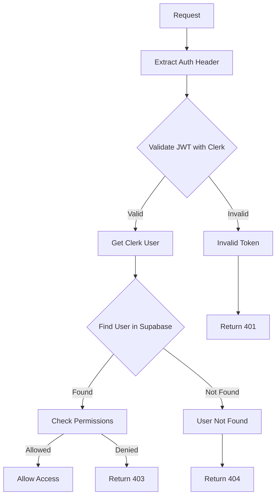

# Security & Row Level Security (RLS)

## Overview

This document details the security measures implemented in the `@editia/core` package, with a particular focus on the management of Supabase Row Level Security (RLS) policies and the secure handling of API keys.

## 🔐 Authentication

### Clerk JWT Tokens

The package leverages Clerk for robust and secure user authentication using JSON Web Tokens (JWTs).

```typescript
// Verifying the JWT token
const { user, errorResponse } = await ClerkAuthService.verifyUser(authHeader);
```

**Security Features:**

-   **Digital Signatures:** All tokens are digitally signed by Clerk using a secret key, ensuring their integrity.
-   **Automatic Expiration:** Tokens have a limited lifetime and automatically expire, reducing the risk of replay attacks.
-   **Server-Side Verification:** Tokens are verified on the server using the Clerk secret key, preventing tampering on the client-side.

### Environment Variables

Securely managing your API keys and secrets is crucial for the security of your application.

**Required Variables:**

```bash
# Clerk (mandatory)
CLERK_SECRET_KEY=sk_test_...

# Supabase (mandatory)
SUPABASE_URL=https://your-project.supabase.co
SUPABASE_SERVICE_ROLE_KEY=eyJ... # For backend use only

# Environment (optional, defaults to 'development')
NODE_ENV=development
```

**Security Best Practices:**

-   **Never commit secrets:** Your `.gitignore` file should include `.env` and other files containing sensitive information.
-   **Use environment variables:** Store all keys and secrets in environment variables, not in your code.
-   **Validate variables on startup:** Ensure that all required environment variables are present and valid when your application starts.

## 🛡️ Row Level Security (RLS)

### The Principle of RLS

Row Level Security (RLS) is a feature of PostgreSQL that allows you to control access to rows in a database table based on the characteristics of the user executing the query. It acts as a powerful security mechanism to ensure that users can only access the data they are authorized to see.

### RLS Policies on the `users` Table

Here are some example RLS policies that you might apply to your `users` table:

```sql
-- Allow users to insert their own data
CREATE POLICY "Users can insert their own data" ON users
FOR INSERT WITH CHECK (auth.uid() = clerk_user_id);

-- Allow users to read their own data
CREATE POLICY "Users can read their own data" ON users
FOR SELECT USING (auth.uid() = clerk_user_id);

-- Allow users to update their own data
CREATE POLICY "Users can update their own data" ON users
FOR UPDATE USING (auth.uid() = clerk_user_id);
```

### Bypassing RLS with the Service Role Key

The `@editia/core` package is designed to be used on the backend, where it often needs to perform administrative tasks that require bypassing RLS policies. For this reason, it uses the `SUPABASE_SERVICE_ROLE_KEY`.

```typescript
// Initializing with the service role key
this.supabaseClient = createClient(
  config.supabaseUrl,
  config.supabaseServiceRoleKey, // This key bypasses RLS
  {
    auth: {
      autoRefreshToken: false,
      persistSession: false,
    },
  }
);
```

**Why is it necessary to bypass RLS?**

1.  **Administrative Operations:** The backend needs to be able to read and write data across all users, for example, to update usage metrics or manage subscriptions.
2.  **Data Synchronization:** The service needs to be able to synchronize data between different services, such as Clerk and Supabase.
3.  **Authentication:** During the authentication process, the service needs to be able to look up a user in the database to verify their existence.

### Security Implications of the Service Role Key

The `SUPABASE_SERVICE_ROLE_KEY` is a powerful secret that should be handled with extreme care.

**Security Measures:**

-   **Server-Side Only:** This key should only be used on the server-side and should never be exposed to the client.
-   **Strict Access Control:** Access to the key should be limited to authorized personnel only.
-   **Audit Logging:** All operations performed with the service role key should be logged to provide an audit trail.

## 🔑 Key Management

### Supabase Keys

It's important to understand the difference between the two main types of Supabase keys:

| Key                  | Usage              | Security Implications           |
| -------------------- | ------------------ | ------------------------------- |
| **Service Role Key** | Backend operations | Bypasses RLS, never expose      |
| **Anon Key**         | Client-side operations | Respects RLS, can be exposed    |

### Best Practices

```typescript
// ✅ Correct: Use the service role key for backend operations
initializeEditiaCore({
  supabaseServiceRoleKey: process.env.SUPABASE_SERVICE_ROLE_KEY!,
});

// ❌ Incorrect: Do not use the anon key for backend operations
initializeEditiaCore({
  supabaseAnonKey: process.env.SUPABASE_ANON_KEY!, // This will fail for administrative tasks
});
```

## 🚨 Error Handling

### Authentication Errors

The package provides a set of standardized error codes to help you handle authentication failures.

```typescript
interface AuthErrorResponse {
  status: number;
  message: string;
  code: string;
}
```

**Error Codes:**

-   `AUTH_HEADER_MISSING` (401): The `Authorization` header is missing from the request.
-   `INVALID_TOKEN_FORMAT` (401): The JWT token is not in the correct format.
-   `TOKEN_VERIFICATION_FAILED` (401): The token could not be verified.
-   `USER_NOT_FOUND` (404): The user does not exist in the database.

### RLS Errors

If you encounter the error `new row violates row-level security policy`, it means that you are trying to perform an operation that is not allowed by your RLS policies. This typically happens when you are using the `anon` key instead of the `service_role` key for a backend operation.

**Solution:** Ensure that you are initializing the `@editia/core` package with the `SUPABASE_SERVICE_ROLE_KEY`.

## 📊 Auditing and Logging

While the `@editia/core` package does not include a built-in logging solution, we strongly recommend that you implement your own logging to track security-related events.

**Recommended Logs:**

-   Failed authentication attempts.
-   Access to protected resources.
-   Modifications to user data.
-   Use of the service role key.

## 🔄 Security Flow



## 🛠️ Production Configuration

When deploying your application to production, it is crucial to use production-specific keys and settings.

```bash
# Production environment variables
NODE_ENV=production
CLERK_SECRET_KEY=sk_live_...
SUPABASE_URL=https://your-project.supabase.co
SUPABASE_SERVICE_ROLE_KEY=eyJ...

# Security and logging settings
LOG_LEVEL=info
SECURITY_AUDIT_ENABLED=true
```

## 🔗 Useful Links

-   [Clerk Authentication](https://clerk.com/docs)
-   [Supabase RLS](https://supabase.com/docs/guides/auth/row-level-security)