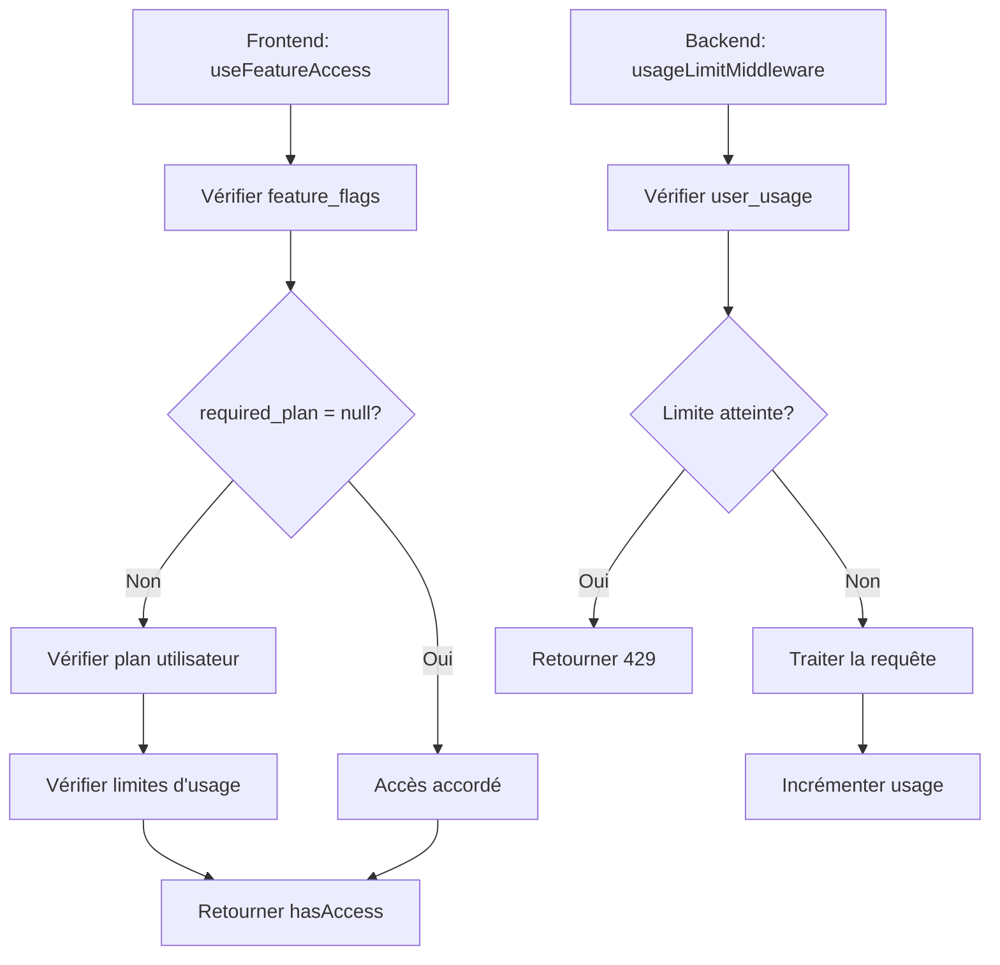

# Référence des Feature Flags - Editia

## 1. Vue d'ensemble

Ce document sert de référence complète pour le système de feature flags d'Editia. Il documente toutes les fonctionnalités, leur gating, et leur utilisation dans l'application mobile et les serveurs backend.

## 2. Architecture du Système

### 2.1. Composants Principaux

#### Frontend (Mobile)

- **Hook `useFeatureAccess`** : Logique de vérification d'accès
- **Composant `FeatureLock`** : UI de gating
- **Guard `AccountAnalysisGuard`** : Guard de niveau layout
- **Contexte `RevenueCat`** : Gestion des abonnements

#### Backend (Serveurs)

- **Server Primary** : `usageTrackingService`, `usageLimitMiddleware`
- **Server Analyzer** : `usageTrackingService`, `usageLimitMiddleware`
- **Base de données** : Tables `feature_flags`, `user_usage`, `subscription_plans`

### 2.2. Flux de Vérification



## 3. Configuration des Feature Flags

### 3.1. Table `feature_flags`

| ID                   | Nom                          | Description                                         | Plan Requis   | Statut   | Backend Endpoints   |
| -------------------- | ---------------------------- | --------------------------------------------------- | ------------- | -------- | ------------------- |
| `account_analysis`   | Analyse de Compte            | Analyse approfondie de votre compte TikTok          | `null` (tous) | ✅ Actif | `/api/analysis`     |
| `chat_ai`            | Chat IA Éditorial            | Chat avec l'IA pour conseils éditoriaux             | `free` (tous) | ✅ Actif | `/api/chat`         |
| `script_generation`  | Génération de Scripts        | Générer des scripts personnalisés avec IA           | `creator`     | ✅ Actif | `/api/scripts`      |
| `video_generation`   | Génération de Vidéos         | Générer des vidéos automatiquement avec IA          | `creator`     | ✅ Actif | `/api/videos`       |
| `source_videos`      | Upload de Vidéos Sources     | Uploader des vidéos B-roll pour vos créations       | `creator`     | ✅ Actif | `/api/sourceVideos` |
| `advanced_subtitles` | Sous-titres Avancés          | Styles de sous-titres personnalisés                 | `creator`     | ✅ Actif | `/api/videos`       |
| `voice_clone`        | Clonage Vocal                | Créer un clone de votre voix pour la narration      | `pro`         | ✅ Actif | `/api/voiceClone`   |
| `multiple_voices`    | Voix Multiples               | Gérer plusieurs voix clonées                        | `pro`         | ✅ Actif | `/api/voiceClone`   |
| `niche_analysis`     | Analyse de Niche/Compétition | Analyses concurrentielles et rapports hebdomadaires | `pro`         | ✅ Actif | `/api/analysis`     |
| `content_ideas`      | Idées de Contenu Proactives  | Notifications de tendances et suggestions           | `pro`         | ✅ Actif | `/api/insights`     |
| `scheduling`         | Programmation de Contenu     | Connecter et programmer sur TikTok/YouTube          | `pro`         | ✅ Actif | `/api/scheduling`   |

### 3.2. Plans d'Abonnement

| Plan ID   | Nom             | Vidéos | Sources | Voix | Analyses | Statut   |
| --------- | --------------- | ------ | ------- | ---- | -------- | -------- |
| `free`    | Plan Découverte | 1      | 5       | 0    | 1        | ✅ Actif |
| `creator` | Plan Créateur   | 15     | 50      | 1    | 4        | ✅ Actif |
| `pro`     | Plan Pro        | ∞      | ∞       | 2    | ∞        | ✅ Actif |

## 4. Utilisation Frontend

### 4.1. Hook `useFeatureAccess`

```typescript
// Vérification d'une fonctionnalité
const { hasAccess, isLoading, remainingUsage } =
  useFeatureAccess('video_generation');

if (isLoading) return <LoadingSpinner />;
if (!hasAccess) return <FeatureLock requiredPlan="creator" />;
return <VideoGenerationComponent />;
```

### 4.2. Hook `useMultipleFeatureAccess`

```typescript
// Vérification de plusieurs fonctionnalités
const { hasAccess, remainingUsage } = useMultipleFeatureAccess([
  'video_generation',
  'voice_clone',
]);

if (!hasAccess) return <FeatureLock requiredPlan="pro" />;
return <AdvancedFeaturesComponent />;
```

### 4.3. Composant `FeatureLock`

```typescript
<FeatureLock requiredPlan="creator" onLockPress={presentPaywall}>
  <VideoGenerationComponent />
</FeatureLock>
```

## 5. Utilisation Backend

### 5.1. Middleware Usage Limit

#### Server Primary

```typescript
// Endpoint avec vérification d'usage
app.post(
  '/api/videos',
  usageLimiter(ResourceType.VIDEOS_GENERATED),
  async (req, res) => {
    // Traitement de la requête
    await incrementResourceUsage(req.user.id, ResourceType.VIDEOS_GENERATED);
  }
);
```

#### Server Analyzer

```typescript
// Endpoint avec vérification d'usage
app.post(
  '/api/analysis',
  usageLimiter(ResourceType.ACCOUNT_ANALYSIS),
  async (req, res) => {
    // Traitement de l'analyse
    await incrementResourceUsage(
      req.body.userId,
      ResourceType.ACCOUNT_ANALYSIS
    );
  }
);
```

### 5.2. Service Usage Tracking

```typescript
// Vérification manuelle d'usage
const { limitReached, usage } = await checkUsageLimit(
  userId,
  ResourceType.VIDEOS_GENERATED
);

if (limitReached) {
  return res.status(429).json({
    error: 'Usage limit reached',
    details: {
      limit: usage.videos_generated_limit,
      used: usage.videos_generated,
    },
  });
}
```

## 6. Types de Ressources

### 6.1. Frontend (Mobile)

```typescript
export type ResourceType =
  | 'videos' // Génération de vidéos
  | 'source_videos' // Upload de vidéos sources
  | 'voice_clones' // Clonage de voix
  | 'account_analysis'; // Analyse de compte
```

### 6.2. Backend (Server Primary)

```typescript
export enum ResourceType {
  SOURCE_VIDEOS = 'source_videos',
  VOICE_CLONES = 'voice_clones',
  VIDEOS_GENERATED = 'videos_generated',
  // ⚠️ Manque ACCOUNT_ANALYSIS
}
```

### 6.3. Backend (Server Analyzer)

```typescript
type ResourceType = 'account_analysis';
// ⚠️ Très limité
```

## 7. Tables de Base de Données

### 7.1. Table `feature_flags`

```sql
CREATE TABLE feature_flags (
  id TEXT PRIMARY KEY,
  name TEXT NOT NULL,
  description TEXT,
  required_plan TEXT REFERENCES subscription_plans(id),
  is_active BOOLEAN DEFAULT true,
  created_at TIMESTAMPTZ DEFAULT NOW()
);
```

### 7.2. Table `user_usage`

```sql
CREATE TABLE user_usage (
  id UUID PRIMARY KEY DEFAULT uuid_generate_v4(),
  user_id UUID NOT NULL REFERENCES users(id),
  videos_generated INT DEFAULT 0,
  videos_generated_limit INT DEFAULT 5,
  source_videos_used INT DEFAULT 0,
  source_videos_limit INT DEFAULT 3,
  voice_clones_used INT DEFAULT 0,
  voice_clones_limit INT DEFAULT 0,
  account_analysis_used INT DEFAULT 0,
  account_analysis_limit INT DEFAULT 0,
  current_plan_id TEXT DEFAULT 'free' REFERENCES subscription_plans(id),
  next_reset_date TIMESTAMPTZ DEFAULT (NOW() + '30 days'::interval),
  created_at TIMESTAMPTZ DEFAULT NOW(),
  updated_at TIMESTAMPTZ DEFAULT NOW()
);
```

### 7.3. Table `subscription_plans`

```sql
CREATE TABLE subscription_plans (
  id TEXT PRIMARY KEY,
  name TEXT NOT NULL,
  description TEXT,
  videos_generated_limit INT NOT NULL,
  source_videos_limit INT NOT NULL,
  voice_clones_limit INT NOT NULL,
  account_analysis_limit INT NOT NULL,
  is_active BOOLEAN DEFAULT true,
  is_unlimited BOOLEAN DEFAULT false,
  created_at TIMESTAMPTZ DEFAULT NOW()
);
```

## 8. Endpoints Backend avec Gating

### 8.1. Server Primary

- **`POST /api/sourceVideos`** : Upload de vidéos sources

  - Middleware : `usageLimiter(ResourceType.SOURCE_VIDEOS)`
  - Incrémentation : `incrementResourceUsage(userId, ResourceType.SOURCE_VIDEOS)`

- **`POST /api/videos`** : Génération de vidéos

  - Middleware : `usageLimiter(ResourceType.VIDEOS_GENERATED)`
  - Incrémentation : `incrementResourceUsage(userId, ResourceType.VIDEOS_GENERATED)`

- **`POST /api/voiceClone`** : Clonage de voix

  - Middleware : `usageLimiter(ResourceType.VOICE_CLONES)`
  - Incrémentation : `incrementResourceUsage(userId, ResourceType.VOICE_CLONES)`

- **`POST /api/scripts`** : Génération de scripts
  - Incrémentation : `incrementResourceUsage(userId, ResourceType.VIDEOS_GENERATED)`

### 8.2. Server Analyzer

- **`POST /api/analysis`** : Analyse de compte
  - Middleware : `usageLimiter(ResourceType.ACCOUNT_ANALYSIS)`
  - Incrémentation : `incrementResourceUsage(userId, ResourceType.ACCOUNT_ANALYSIS)`

## 9. Problèmes Identifiés

### 9.1. Incohérences de Types

- **Server Primary** : `ResourceType` enum manque `account_analysis`
- **Server Analyzer** : `ResourceType` limité à `account_analysis` uniquement
- **Mobile** : `ResourceType` utilise des strings au lieu d'enum

### 9.2. Duplication de Code

- Services `usageTrackingService` dupliqués dans les deux serveurs
- Middleware `usageLimitMiddleware` dupliqués
- Logique de vérification d'usage répétée

### 9.3. Gestion d'Erreurs Incohérente

- **Server Primary** : Fail open en cas d'erreur
- **Server Analyzer** : Fail closed en cas d'erreur
- **Mobile** : Gestion d'erreur personnalisée

## 10. Stratégie d'Harmonisation

### 10.1. Phase 1 : Standardisation des Types

- Créer un package partagé `@editia/shared`
- Définir des types unifiés pour tous les composants
- Migrer vers un enum `ResourceType` complet

### 10.2. Phase 2 : Service Partagé

- Créer un service `UsageService` unifié
- Éliminer la duplication de code
- Standardiser la gestion d'erreurs

### 10.3. Phase 3 : Middleware Unifié

- Créer un middleware `usageMiddleware` partagé
- Harmoniser la logique de vérification
- Standardiser les réponses d'erreur

### 10.4. Phase 4 : Feature Flags Backend

- Créer un service `FeatureFlagsService`
- Implémenter un middleware `featureFlagsMiddleware`
- Intégrer la vérification de feature flags dans les endpoints

## 11. Bonnes Pratiques

### 11.1. Frontend

- Toujours utiliser `useFeatureAccess` pour vérifier l'accès
- Gérer les états de chargement
- Afficher des messages d'erreur clairs
- Utiliser `FeatureLock` pour le gating UI

### 11.2. Backend

- Toujours utiliser le middleware `usageLimiter`
- Incrémenter l'usage après un traitement réussi
- Retourner des codes d'erreur appropriés (429 pour limite atteinte)
- Logger les vérifications d'usage pour le debugging

### 11.3. Base de Données

- Maintenir la cohérence entre `feature_flags` et `subscription_plans`
- Utiliser des contraintes de clés étrangères
- Indexer les colonnes fréquemment utilisées
- Surveiller les performances des requêtes

## 12. Monitoring et Debugging

### 12.1. Métriques à Surveiller

- Taux de rejet par limite d'usage
- Distribution des plans d'abonnement
- Performance des requêtes de vérification d'usage
- Erreurs de synchronisation RevenueCat

### 12.2. Logs Importants

- Vérifications d'usage réussies/échouées
- Incrémentations d'usage
- Changements de plan d'abonnement
- Erreurs de base de données

### 12.3. Alertes

- Taux de rejet > 10% pour une fonctionnalité
- Erreurs de synchronisation RevenueCat
- Performance dégradée des requêtes d'usage
- Incohérences dans les données d'usage

## 13. Évolution Future

### 13.1. Nouvelles Fonctionnalités

- Système de crédits flexibles
- Limites par période (quotidiennes, hebdomadaires)
- Gating basé sur le comportement utilisateur
- A/B testing des limites

### 13.2. Améliorations Techniques

- Cache Redis pour les vérifications d'usage
- Batch processing pour les incrémentations
- Analytics avancées d'usage
- Intégration avec d'autres systèmes de paiement

## 14. Conclusion

Le système de feature flags d'Editia est robuste mais nécessite une harmonisation entre les composants frontend et backend. La stratégie d'harmonisation proposée permettra d'améliorer la cohérence, la maintenabilité et la fiabilité du système.

**Prochaines étapes prioritaires** :

1. Standardiser les types `ResourceType`
2. Créer un service partagé pour l'usage tracking
3. Harmoniser les middlewares backend
4. Implémenter la vérification de feature flags côté backend
