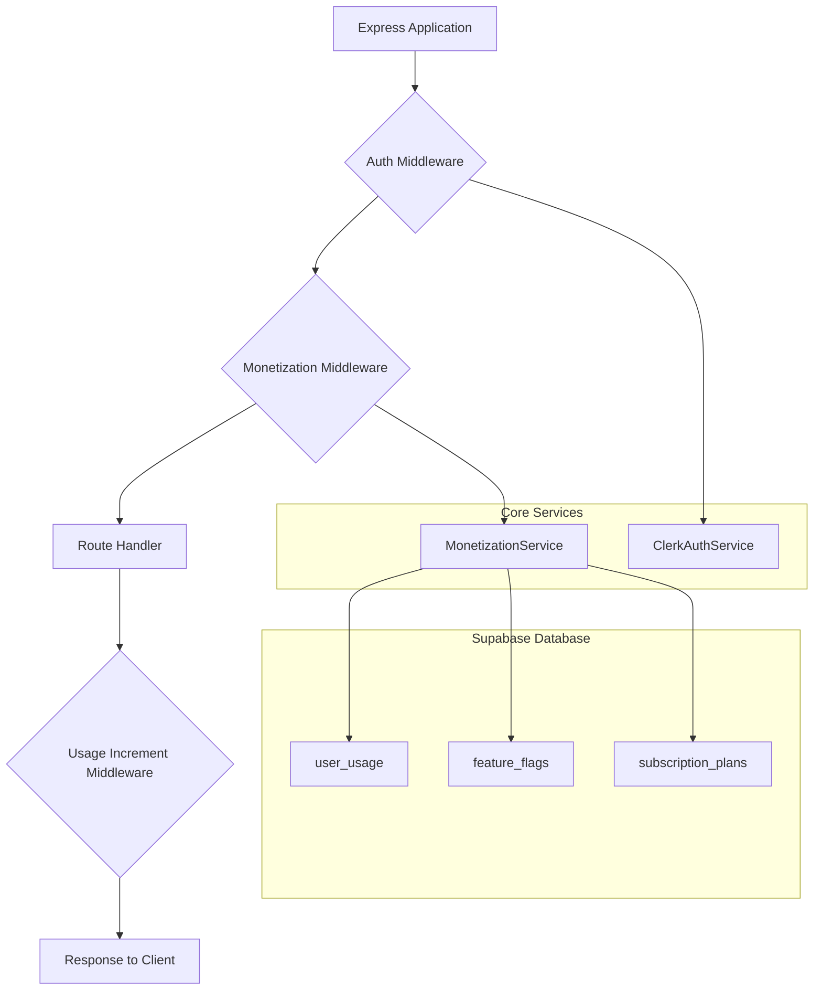

# Backend Monetization System - Editia Core

## Overview

The backend monetization system provides a centralized and robust way to handle subscription-based access control and usage tracking for all Editia services. It is designed to be flexible, performant, and easy to integrate into any Express application.

The system is built around a core `MonetizationService` and a set of Express middleware functions that simplify the process of protecting routes and tracking usage.

## Architecture

The monetization system follows a layered architecture that separates concerns and promotes reusability.



### Data Flow

1.  **Authentication:** The `Auth Middleware` (e.g., `authenticateUser`) verifies the user's identity using the `ClerkAuthService` and attaches the user object to the request.
2.  **Monetization Check:** The `Monetization Middleware` (e.g., `videoGenerationMiddleware`) checks if the user has access to the requested feature and if they have enough usage credits. It uses the `MonetizationService` to perform these checks against the Supabase database.
3.  **Route Handling:** If the monetization check passes, the request proceeds to the `Route Handler`, which contains the core business logic of the endpoint.
4.  **Usage Incrementation:** After the route handler successfully completes its operation, the `Usage Increment Middleware` intercepts the response and, if the operation was successful, calls the `MonetizationService` to increment the user's usage for the corresponding action.
5.  **Response:** The final response is sent to the client.

### Why a Separate Usage Increment Middleware?

The decision to use a separate middleware for incrementing usage is intentional and provides several benefits:

-   **Atomicity:** Usage is only incremented after the core operation has successfully completed. This prevents users from being charged for failed operations.
-   **Separation of Concerns:** The monetization check is decoupled from the usage incrementation, making the system more modular and easier to maintain.
-   **Flexibility:** It allows for more complex workflows where usage might not always be incremented (e.g., for free features or retries).

## Core Components

### 1. MonetizationService

The `MonetizationService` is the heart of the monetization system. It is a singleton that encapsulates all the logic for checking permissions, validating usage, and interacting with the database.

**Key Features:**

-   **Singleton Pattern:** Ensures a single, consistent instance of the service throughout the application.
-   **Caching:** Caches feature flags and user usage data to minimize database queries and improve performance.
-   **Comprehensive Error Handling:** Provides detailed error messages and codes to help diagnose issues.
-   **Development Debugging Tools:** Includes a `getDebugInfo` method for inspecting the state of the service in development environments.

**Main Methods:**

-   `checkFeatureAccess()`: Verifies if a user's current plan grants them access to a specific feature.
-   `validateUsage()`: Checks if a user has remaining usage credits for a particular action.
-   `checkMonetization()`: A comprehensive method that combines `checkFeatureAccess` and `validateUsage` into a single call.
-   `incrementUsage()`: Increments a user's usage for a specific action.
-   `getUserUsage()`: Retrieves a user's current usage data from the database.

### 2. Express Middleware

The package provides a set of pre-built Express middleware functions that make it easy to protect your routes.

**Available Middleware:**

-   `videoGenerationMiddleware`: For video generation endpoints.
-   `sourceVideoUploadMiddleware`: For file upload endpoints.
-   `voiceCloneMiddleware`: For voice cloning endpoints.
-   `accountAnalysisMiddleware`: For account analysis endpoints.
-   `scriptGenerationMiddleware`: For script generation (does not increment usage).
-   `chatAiMiddleware`: For AI chat (does not increment usage).

## Quick Start

### 1. Initialize the Service

Before you can use the monetization middleware, you need to initialize the `MonetizationService` at the startup of your application.

```typescript
import { MonetizationService } from 'editia-core';
import { createClient } from '@supabase/supabase-js';

// Initialize at app startup
MonetizationService.initialize({
  supabaseClient: createClient(
    process.env.SUPABASE_URL!,
    process.env.SUPABASE_SERVICE_ROLE_KEY! // Use the service role key for admin-level access
  ),
  environment: process.env.NODE_ENV as 'development' | 'production' | 'test',
});
```

**Important:** Always use the `SUPABASE_SERVICE_ROLE_KEY` when initializing the service on the backend. This key allows the service to bypass Row Level Security (RLS) policies and perform administrative tasks like reading feature flags and updating user usage data.

### 2. Use Preset Middleware

The easiest way to protect your routes is to use the preset middleware functions.

```typescript
import {
  authenticateUser,
  videoGenerationMiddleware,
  createUsageIncrementMiddleware,
  userFriendlyMonetizationErrorHandler,
} from 'editia-core';

// Apply to video generation route
app.post(
  '/api/videos/generate',
  authenticateUser, // 1. Authenticate the user
  videoGenerationMiddleware, // 2. Check monetization
  createUsageIncrementMiddleware(), // 3. Increment usage on success
  async (req, res) => {
    // Your video generation logic here
    // Usage will be automatically incremented on success
    res.json({ success: true, videoUrl: '...' });
  }
);
```

### 3. Custom Middleware

For more advanced scenarios, you can create your own custom monetization middleware using the `createMonetizationMiddleware` factory function.

```typescript
import { createMonetizationMiddleware } from 'editia-core';

const customMonetizationMiddleware = createMonetizationMiddleware({
  featureId: 'custom_feature',
  incrementUsage: true,
  action: 'video_generation',
  errorHandler: userFriendlyMonetizationErrorHandler,
});

app.post('/api/custom-endpoint', customMonetizationMiddleware, (req, res) => {
  // Your logic here
});
```

## Feature Configuration

### Feature Flags Table

The monetization system uses a `feature_flags` table in Supabase to define the access requirements for each feature.

```sql
CREATE TABLE feature_flags (
  id TEXT PRIMARY KEY,
  name TEXT NOT NULL,
  description TEXT,
  required_plan TEXT REFERENCES subscription_plans(id),
  is_active BOOLEAN DEFAULT true,
  created_at TIMESTAMPTZ DEFAULT NOW()
);
```

**Predefined Features:**

-   `video_generation`: Video generation (requires a paid plan).
-   `source_videos`: Source video upload (requires a paid plan).
-   `voice_clone`: Voice cloning (requires a paid plan).
-   `account_analysis`: Account analysis (requires a paid plan).
-   `script_generation`: Script generation (available to all users).
-   `chat_ai`: AI chat (available to all users).

### Usage Tracking

User usage is tracked in the `user_usage` table.

```sql
-- Key fields for usage tracking
CREATE TABLE user_usage (
  user_id UUID PRIMARY KEY REFERENCES users(id),
  current_plan_id TEXT REFERENCES subscription_plans(id),
  videos_generated INT DEFAULT 0,
  videos_generated_limit INT,
  source_videos_used INT DEFAULT 0,
  source_videos_limit INT,
  voice_clones_used INT DEFAULT 0,
  voice_clones_limit INT,
  account_analysis_used INT DEFAULT 0,
  account_analysis_limit INT,
  -- other fields
);
```

## Response Format

The middleware provides standardized success and error responses.

### Success Response

When an operation is successful, the response will include a `success` flag and any relevant data. The `createUsageIncrementMiddleware` also adds the remaining usage and total limit to the response.

```json
{
  "success": true,
  "videoUrl": "https://...",
  "remainingUsage": 14,
  "totalLimit": 15
}
```

### Error Response (Access Denied)

If the user's plan does not grant them access to the feature, the middleware will return a `FEATURE_ACCESS_DENIED` error.

```json
{
  "success": false,
  "error": "Voice cloning is not available in your current plan.",
  "title": "Voice Cloning Not Available",
  "code": "FEATURE_ACCESS_DENIED",
  "upgrade": {
    "requiredPlan": "creator",
    "currentPlan": "free",
    "message": "Upgrade to access voice cloning features."
  },
  "limits": {
    "remaining": 0,
    "total": 0
  }
}
```

### Error Response (Usage Limit Reached)

If the user has exhausted their usage credits for a particular feature, the middleware will return a `USAGE_LIMIT_REACHED` error.

```json
{
  "success": false,
  "error": "You have reached your video generation limit for this month.",
  "title": "Video Generation Limit Reached",
  "code": "USAGE_LIMIT_REACHED",
  "limits": {
    "remaining": 0,
    "total": 15
  }
}
```

## Advanced Usage

### 1. Custom Error Handling

You can provide a custom error handler to the `createMonetizationMiddleware` function to override the default error responses.

```typescript
const customErrorHandler = (
  req: Request,
  res: Response,
  result: MonetizationCheckResult
) => {
  // Your custom error logic
  res.status(403).json({
    error: 'Custom error message',
    upgradeUrl: '/upgrade',
    // ... other custom fields
  });
};

const customMiddleware = createMonetizationMiddleware({
  featureId: 'video_generation',
  incrementUsage: true,
  action: 'video_generation',
  errorHandler: customErrorHandler,
});
```

### 2. Manual Service Usage

For scenarios where you need more control, you can use the `MonetizationService` directly in your route handlers.

```typescript
import { MonetizationService } from 'editia-core';

const monetizationService = MonetizationService.getInstance();

// Check access manually
const result = await monetizationService.checkMonetization(
  userId,
  'video_generation'
);

if (result.success) {
  // Proceed with operation
  await generateVideo();

  // Increment usage
  await monetizationService.incrementUsage(userId, 'video_generation');
} else {
  // Handle access denied
  res.status(403).json({ error: result.error });
}
```

### 3. Development Debugging

In development, you can use the `getDebugInfo` method to get a comprehensive overview of a user's monetization status.

```typescript
// Get comprehensive debug info (development only)
const debugInfo = await monetizationService.getDebugInfo(userId);
console.log('Debug Info:', debugInfo);
```

## Integration Examples

### 1. Video Generation Endpoint

```typescript
app.post(
  '/api/videos/generate',
  authenticateUser, // Your auth middleware
  videoGenerationMiddleware,
  createUsageIncrementMiddleware(),
  async (req, res) => {
    try {
      const { script, sourceVideos } = req.body;

      // Generate video (your logic)
      const videoUrl = await generateVideo(script, sourceVideos);

      res.json({
        success: true,
        videoUrl,
        remainingUsage: req.monetization?.remainingUsage,
        totalLimit: req.monetization?.totalLimit,
      });
    } catch (error) {
      res.status(500).json({ success: false, error: error.message });
    }
  }
);
```

### 2. File Upload Endpoint

```typescript
app.post(
  '/api/videos/upload',
  authenticateUser,
  sourceVideoUploadMiddleware,
  createUsageIncrementMiddleware(),
  upload.single('video'), // Your file upload middleware
  async (req, res) => {
    try {
      const file = req.file;

      // Process upload (your logic)
      const videoId = await processVideoUpload(file);

      res.json({
        success: true,
        videoId,
        remainingUploads: req.monetization?.remainingUsage,
      });
    } catch (error) {
      res.status(500).json({ success: false, error: error.message });
    }
  }
);
```

## Best Practices

-   **Error Handling:** Always use appropriate error handlers to provide clear feedback to users.
-   **Performance:** The service includes caching to optimize performance. Use the preset middleware whenever possible to take advantage of this.
-   **Security:** Always authenticate users before performing monetization checks. Use RLS policies in Supabase as an additional layer of security.
-   **Monitoring:** Monitor usage patterns and limits to identify potential issues and opportunities for optimization.

## Troubleshooting

-   **"Service not initialized" error:** Make sure you are calling `MonetizationService.initialize()` at the startup of your application.
-   **"User usage not found" error:** Ensure that a corresponding record exists in the `user_usage` table for the user.
-   **"Feature flag not found" error:** Make sure the feature is defined in the `feature_flags` table in your Supabase database.